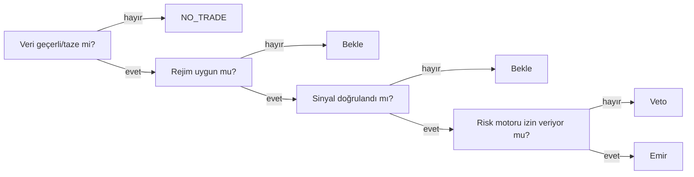

# ECA Anatomi, Karar Akışı & Şema

## ECA nedir?

**ECA = Event – Condition – Action** (Olay – Koşul – Eylem). Otomasyon ve trading'de klasik bir kural motoru paradigmasıdır. Her alım/satım kararı şu üçlüye indirgenir:

```
OLAY (Event)      → Ne oldu?          (ör: 1 saatlik mum kapandı)
KOŞUL (Condition) → Şart sağlandı mı?  (ör: RSI < 30 VE fiyat EMA200 üstünde)
EYLEM (Action)    → Ne yapılacak?      (ör: %1 risk pozisyon aç, SL = 1.5×ATR)
```

**"Çapraz" (cross)** iki anlamda desteklenir:

1. **Çapraz zaman dilimi (multi-timeframe):** günlük trend yukarıyken 15 dk'da al.
2. **Çapraz kural/piyasa:** bir kural başka piyasanın durumunu koşul yapar (ör. BTC risk-off'a geçtiyse altcoin alma).

## Bileşenler

=== "Olaylar (Events)"

    - Yeni mum kapanışı (1m/5m/15m/1h/4h/1d)
    - Fiyat tick / seviye geçme
    - İndikatör kesişimi (EMA9, EMA21'i yukarı kesti)
    - Hacim ani artışı
    - Funding rate güncellemesi (futures)
    - Emir doldu / pozisyon açıldı-kapandı
    - Zaman tabanlı (saat başı, seans açılışı)
    - Sentiment/haber sinyali

=== "Koşullar (Conditions)"

    - İndikatör eşikleri: `RSI < 30`, `ADX > 25`
    - Ortalama kesişimi: `EMA50 > EMA200`, `MACD > Signal`
    - Volatilite: ATR ile stop mesafesi, Bollinger genişliği
    - Multi-timeframe onay: `günlük trend ↑ VE 15dk RSI < 35`
    - Çapraz koşul: `BTC son 1 saatte %2'den fazla düşmediyse`
    - Risk koşulu: `açık pozisyon < 3 VE günlük zarar < %2`
    - Sentiment: `korku-açgözlülük < 25`

=== "Eylemler (Actions)"

    - Market/limit emirle pozisyon aç (boyut risk katmanından)
    - SL + TP kur (sabit %, ATR bazlı, trailing)
    - Kademeli giriş/çıkış (DCA / scale-in/out)
    - Pozisyonu kapat / ters çevir
    - Kaldıracı ayarla (futures)
    - Sadece alarm gönder (semi-auto)
    - Hiçbir şey yapma (`NO_TRADE`)

## Karar akışı — 4 Kapı

Her işlem tek göstergeye değil, **sırayla dört kapıya** dayanır. Bir kapı geçilmezse işlem oluşmaz:



## Çakışma önceliği

Kurallar çatışırsa sıra **değiştirilemez** (yüksek öncelik önce çalışır ve alttakini veto edebilir):

1. **Acil durdurma (kill-switch)**
2. **Veri bütünlüğü & bağlantı sağlığı**
3. **Hesap/pozisyon uzlaştırması (reconciliation)**
4. **Risk limiti**
5. **Koruyucu çıkış** (stop / zarar kes)
6. **Pozisyon küçültme**
7. **Normal satış**
8. **Yeni alış**
9. **Bilgilendirme/alarm**

!!! danger "Alış her zaman en düşük önceliktir"
    Bir "al" kuralı tetiklense bile, üstündeki herhangi bir kural (veri bayat, risk limiti aşıldı, kill-switch aktif) onu veto edebilir. Kural motoru literatüründe bu `priority → specificity → recency` çözümüyle uygulanır; ek olarak **mutual-exclusion grupları** (aynı sembolde eşzamanlı `enter_long` + `enter_short` engellenir).

## ECA kural şeması (YAML DSL)

Kurallar YAML olarak, aşağıdaki alanlar **zorunlu** tutularak yazılır. Eksik/yoruma açık alan varsa kural **reddedilir** (deterministiklik):

```yaml
rule_id: rsi_pullback_btc          # benzersiz kimlik
version: 1.2.0                      # semver
status: paper                      # draft | shadow | paper | approved | retired
market: spot                       # spot | futures | margin
symbol: BTCUSDT
timeframe: 1h                      # karar TF
event: on_bar_close
conditions:
  data_freshness:                  # KAPI 1
    max_age_seconds: 90
  market_regime:                   # KAPI 2
    require: trend_up              # rejim sınıflandırıcıdan
  signal:                          # KAPI 3 — TA/confluence
    all:
      - { htf: "4h", expr: "ema50 > ema200" }
      - { expr: "close > ema50" }
      - { expr: "rsi_14 crosses_above 40" }
  risk_requirements:               # KAPI 4 (ön-şart)
    max_open_positions: 3
    max_daily_loss_pct: 2
action:
  order_policy: { type: limit, tif: GTC, expiry_min: 30 }
  position_sizing: { method: atr_risk, risk_pct: 1.0, atr_mult: 2.0 }
  exit_policy: { stop: "2*atr", take_profit: "3*atr", trailing: supertrend }
cooldown_min: 60                   # aynı sembolde tekrar bekleme
conflict_priority: 8               # yukarıdaki öncelik seviyesi
idempotency_key: auto             # çift-emir önleme (client-order-id)
evidence_sources: [binance_klines] # sinyali besleyen kaynaklar
backtest_id: bt_2026_0731_abc     # bu kuralı doğrulayan backtest
approved_by: null                  # canlıya kim onayladı
```

**Deterministik vs ML/AI:** ECA katmanı deterministiktir (aynı girdi → aynı çıktı; audit ve backtest-tekrarlanabilirliği kolay). AI/ML çıktısı bir **koşul olarak enjekte edilir** (`{ai_signal: {gt: 0.7}}`) — böylece açıklanabilirlik ve güvenlik korunur. Bkz. [AI Katmanı](ai.md).

Örnek kural kataloğu için → [Örnek Kurallar](ornekler.md).
