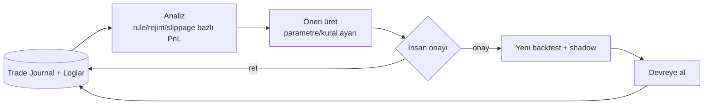

# Feedback & Erken Zarar Kesme

> Kullanıcı gereksinimi: *"Zarar derinleşmeden kapatabilecek, duygusal olmayan, veri odaklı kararlar verecek; ya da uzun vadeli yatırım önerileri sunacak feedback sistemi olmalı."*

Feedback sistemi iki işi yapar: **(1)** açık pozisyonları duygusuz, veri-odaklı kurallarla korur (erken zarar kesme); **(2)** loglardan öğrenerek sistemi ve kullanıcıyı **sürekli iyileştirir** (öneriler + uzun vade).

## 1. Duygusuz, veri-odaklı erken zarar kesme

İnsan "belki geri döner" diye zararı büyütür; bot bunu yapmaz — kural ve metrik ne diyorsa onu uygular. Bu, [ECA-005 koruyucu çıkış](../eca/ornekler.md#eca-005-koruyucu-cikis) ve [risk motoru](../risk/yonetim.md) üzerine kurulur.

| Tetikleyici | Mantık | Eylem |
|-------------|--------|-------|
| **ATR/volatilite stop** | Fiyat `giriş − k·ATR` seviyesine ulaştı | Pozisyonu azalt/kapat |
| **Sabit R kaybı** | Kayıp planlanan 1R'ı geçti | Kapat (duygu yok) |
| **Zaman bazlı çıkış** | Pozisyon X mumdur kâra geçmedi (dead-money) | Küçült/kapat, sermayeyi serbest bırak |
| **Rejim değişimi** | Giriş trend rejimindeydi, rejim yatay/ters döndü | Trend-bağımlı pozisyonu kapat |
| **Çapraz piyasa şoku** | BTC risk-off / stablecoin depeg (ECA-009) | Altcoin risklerini azalt |
| **Günlük zarar limiti** | Günlük -%X aşıldı (ECA-006) | Tüm yeni işlemleri durdur (kill-switch) |
| **Korelasyon patlaması** | Portföy korelasyonu 1'e yaklaştı | Toplam maruziyeti düşür |

!!! danger "\"Duygusuz\" ne demek — ve sınırı"
    Bot, kayıptan kaçmak için stopu genişletmez, ortalama düşürmek için "düşen bıçağı" almaz, "bir kere daha denerim" demez. Kararlar loglanmış eşiklere dayanır. **Ancak:** hiçbir çıkış mantığı kaybı *garanti* etmez — stop, gap/slippage nedeniyle kötü dolabilir (bkz. [Risk](../risk/yonetim.md#2-stop-loss-take-profit-trailing)). "Duygusuz" = tutarlı ve kurala bağlı; "risksiz" değil.

## 2. Sürekli iyileştirme döngüsü

Loglardaki "sistemsel derinlik" ([Loglama](loglama.md)) burada işe yarar. Feedback motoru trade journal'ı analiz edip **öneriler** üretir — ama değişiklikleri **otomatik uygulamaz**; insan onayı + yeni backtest gerektirir.

**Analiz örnekleri (loglardan):**

- Hangi `rule_id` hangi **rejimde** kazandırıyor/kaybettiriyor? (rejim-bazlı devre dışı bırakma önerisi)
- **Slippage dağılımı** hangi saat/sembolde kötü? (o pencerelerde işlem kısıtı önerisi)
- **Reddedilen sinyaller** sonradan kârlı olur muydu? (fazla-katı filtre tespiti)
- Win-rate düşerken **profit factor** koruyor mu? (R:R ayarı önerisi)
- Ardışık kayıplar (losing streak) bir kuralda mı yoğunlaşıyor? (kural karantinası önerisi)

Bu, [`trade-journal-analyze`](../skills.md) Claude skill'inin görevidir.

## 3. Uzun vadeli yatırım önerileri

Kısa vadeli işlem uygun değilken (yüksek belirsizlik, yatay-belirsiz rejim, yüksek maliyet), feedback sistemi **uzun vade** modu önerebilir:

- **DCA önerisi:** trend/birikim rejiminde kademeli alım planı (bkz. [Strateji Aileleri](../strateji/aileler.md)).
- **Maruziyet ayarı:** makro rejime göre (FRED sinyalleri, F&G endeksi) toplam risk-on/risk-off oranı önerisi.
- **"İşlem yapma" önerisi:** bazen en iyi hamle beklemektir; sistem düşük-beklenti dönemlerini işaretler.

!!! warning "Öneri ≠ tavsiye ≠ otomatik icra"
    Bu öneriler **sistemin kendi verisine** dayalı, kullanıcıya sunulan bilgilerdir; **kişisel yatırım tavsiyesi değildir** ve uzun-vade eylemleri (özellikle büyük tahsis değişiklikleri) kullanıcı onayıyla yürür. Otomatik icra yalnızca risk-sınırlı, backtest'i geçmiş kurallar için geçerlidir.

## 4. Bildirim kanalları

- **Telegram / e-posta:** kritik olaylar (kill-switch, büyük drawdown, reconciliation uyuşmazlığı, günlük özet, öneri hazır).
- **Dashboard uyarı merkezi:** aktif uyarılar + geçmiş.
- **Semi-auto onay:** semi-auto modda öneri Telegram/GUI'den tek tıkla onaylanır/reddedilir; her ikisi de loglanır.
