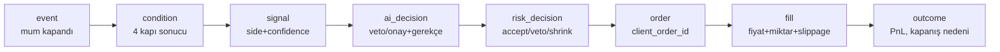

# Loglama & Log Viewer

> Kullanıcı gereksinimi: *"Log tutmalı, filtreli log viewer olmalı. Loglara göre sürekli iyileştirme fırsatı yakalamak için log sisteminde sistemsel derinlik olmalı."*

Bu botta loglama bir "yan özellik" değil, **birinci sınıf bir alt sistem**dir. Çünkü neyin neden yapıldığını göremezseniz stratejiyi iyileştiremezsiniz ve bir sorunda kök nedeni bulamazsınız.

## 1. Yapılandırılmış (structured) loglama

Tüm loglar **JSON satırları** olarak yazılır (insan-okunur konsol formatı ayrıca geliştirmede). Her kayıt makine-işlenebilir ve filtrelenebilir olmalı.

```json
{
  "ts": "2026-08-01T14:22:03.481Z",
  "level": "INFO",
  "module": "eca.engine",
  "correlation_id": "dec_7f3a9c",
  "symbol": "BTCUSDT",
  "market": "spot",
  "mode": "paper",
  "rule_id": "rsi_pullback_btc",
  "event": "signal_generated",
  "detail": { "side": "long", "confidence": 0.72, "reasons": ["4h_trend_up","rsi_cross_40"] }
}
```

### Log seviyeleri
| Seviye | Kullanım |
|--------|----------|
| `TRACE` | İndikatör hesap ayrıntıları, tick akışı (geliştirme) |
| `DEBUG` | Kural değerlendirme adımları, kapı geçişleri |
| `INFO` | Sinyal, emir, fill, mod değişimi, keepalive |
| `WARN` | Rate-limit yaklaşımı, veri gecikmesi, reconnect, kısmi doluş |
| `ERROR` | Emir reddi, API hatası, reconciliation uyuşmazlığı |
| `CRITICAL` | Kill-switch, veri boşluğu → NO_TRADE, devre kesici |

## 2. Sistemsel derinlik — Karar Denetim İzi (Decision Audit Trail)

"Sistemsel derinlik" = her kararın **uçtan uca izlenebilir** olması. Bir `correlation_id` (karar kimliği), tek bir kararın tüm yaşam döngüsünü birbirine bağlar:



Aynı `correlation_id` ile filtreleyince, "neden bu işlem açıldı, hangi koşullar sağlandı, AI ne dedi, risk ne dedi, ne kadar slippage oldu, sonuçta ne kazandırdı/kaybettirdi" **tek zincirde** görülür. Bu, sürekli iyileştirmenin ham maddesidir (bkz. [Feedback](feedback.md)).

### Ne loglanır (sistemsel derinlik listesi)
- **Her kapı kararı:** veri tazeliği, rejim, sinyal, risk — geçti/kaldı + değerler.
- **Reddedilen sinyaller de:** neden reddedildiği (hangi kapı, hangi koşul). *Sadece açılan işlemler değil.*
- **AI girdi/çıktı/gerekçe.**
- **Risk motoru kararı ve tetiklenen limit.**
- **Emir yaşam döngüsü:** niyet → gönderim → kabul → (kısmi) fill → kapanış. Slippage = beklenen − gerçekleşen.
- **Operasyon olayları:** WS reconnect, rate-limit header değerleri, clock drift, reconciliation farkları.
- **Mod/konfig değişiklikleri:** kim, ne zaman, ne değiştirdi.

## 3. Saklama & altyapı

- **Append-only:** loglar ve trade journal değiştirilemez (denetlenebilirlik). Bkz. [Güvenlik](../guvenlik.md).
- **İki katman:** dosya (JSONL, döndürülür/rotate) + **veritabanı** (PostgreSQL/TimescaleDB — sorgulanabilir, zaman-serisi).
- **Retention politikası:** TRACE/DEBUG kısa (ör. 7 gün), INFO+ uzun (ör. 1 yıl+), trade journal **kalıcı**.
- **Sırlar asla loglanmaz:** API key, token, imza. Log maskeleme filtresi zorunlu.
- **Opsiyonel gözlemlenebilirlik yığını:** Prometheus (metrik) + Grafana (dashboard) + Loki (log toplama) — ileri faz.

## 4. Filtreli Log Viewer (GUI özelliği)

Web dashboard'da bir **log viewer** paneli:

- **Filtreler:** seviye, modül, sembol, market, `rule_id`, `correlation_id`, mod (testnet/paper/live), zaman aralığı.
- **Tam-metin arama** (JSON alanlarında).
- **Canlı tail** (WebSocket ile akan loglar; duraklat/devam).
- **Karar zinciri görünümü:** bir `correlation_id`'ye tıklayınca o kararın tüm adımları (event→…→outcome) zaman çizelgesinde.
- **Log → Trade bağlantısı:** bir log kaydından ilgili işleme/pozisyona ve [monitoring](monitoring.md) grafiğindeki noktaya atla.
- **Dışa aktarma:** filtrelenmiş sonucu CSV/JSON indir (analiz/rapor için).
- **Renk kodu + rozet:** WARN/ERROR/CRITICAL vurgulu; veto'lar ayrı renkte.

!!! tip "Neden bu kadar derin?"
    Botun performansını artıran şey yeni "sihirli indikatör" değil, **çalışan sistemin kendi verisiyle iyileştirilmesidir.** Reddedilen sinyaller, slippage dağılımı, hangi kuralın hangi rejimde kazandırdığı — hepsi loglarda. Log viewer bu madeni kazmanın kürek­idir.
