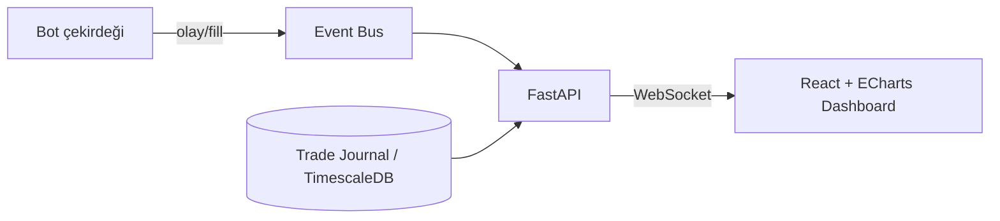

# Canlı Monitoring (ECharts)

> Kullanıcı gereksinimi: *"Kâr ve zararları anlık görüntüleyebileceğimiz, ECharts monitoring live ekranlar olmalı."*

Web dashboard, botun durumunu **gerçek zamanlı** gösterir. Grafikler [Apache ECharts](https://echarts.apache.org/) ile çizilir; veriler FastAPI backend'inden **WebSocket** üzerinden canlı akar.

## Panel seti

| Panel | Görselleştirme | Veri |
|-------|----------------|------|
| **Equity eğrisi** | Çizgi + alan | Toplam sermaye zaman serisi (gerçekleşmiş + gerçekleşmemiş) |
| **Günlük PnL** | Bar (yeşil/kırmızı) | Gün bazında kâr/zarar; günlük hedef (+%2) ve limit çizgileri |
| **Drawdown** | Ters alan / gauge | Tepe-dip düşüş %; circuit-breaker eşiği işaretli |
| **Açık pozisyonlar** | Tablo | Sembol, yön, giriş, anlık PnL, SL/TP, kaldıraç |
| **Strateji/kural bazlı PnL** | Yatay bar | Hangi `rule_id` ne kazandırdı/kaybettirdi |
| **Win-rate & profit factor** | Stat kartları | Metrikler (bkz. [Risk](../risk/yonetim.md)) |
| **Risk göstergesi** | Gauge | Günlük zarar / limit oranı, kill-switch durumu |

## Canlı veri akışı

- **Anlık:** fill, pozisyon değişimi, PnL güncellemesi WebSocket ile push edilir → grafik `setOption` ile güncellenir.
- **Tarihsel:** sayfa açılışında REST'ten equity/PnL geçmişi çekilir.
- **Mod bilgisi:** her panelde aktif mod (testnet/paper/semi-auto/full-auto) rozeti; canlı modda kırmızı vurgu.

## Canlı demo (örnek veri)

Aşağıdaki grafikler **örnek verilerle** çalışan bir önizlemedir (gerçek bot verisi değildir); dashboard'un görünümünü temsil eder. Değerler birkaç saniyede bir simüle güncellenir.

  

    
Toplam PnL

    
+—

  

  

    
Win-rate

    
—

  

  

    
Max Drawdown

    
—

  

  

    
Açık Pozisyon

    
3

  

!!! note "Bu bir mockup'tır"
    Yukarıdaki grafikler dokümantasyonu somutlaştırmak için örnek/simüle veriyle çalışır. Gerçek dashboard, aynı ECharts bileşenlerini FastAPI WebSocket'ten gelen canlı bot verisiyle besleyecektir. Grafikler görünmüyorsa sayfayı yenileyin (CDN yüklemesi).
