# Tolga Trading Bot — Dokümantasyon

Binance tabanlı, **ECA (Event–Condition–Action / Olay–Koşul–Eylem)** kural motoru üzerine kurulu; **spot + futures + margin** destekleyen; **backtest / paper / semi-auto / full-auto** modlarında çalışan, **AI destekli** ve **web GUI**'li bir trading bot için gereksinim ve mimari dokümantasyonu.

!!! danger "Önce bunu oku — Sorumluluk reddi"
    Bu dokümantasyon **yazılım mühendisliği ve eğitim** amaçlıdır. **Yatırım tavsiyesi değildir**, hiçbir kâr garantisi vermez. Kripto (özellikle kaldıraçlı futures) işlemleri tüm sermayenizi kaybettirebilir. Buradaki her strateji/eşik değeri "kesin kazandırır" diye değil, **"backtest edilecek hipotez"** olarak sunulmuştur. Botu gerçek para ile çalıştırmadan önce **backtest → paper → testnet** aşamalarından geçirin.

## Bu doküman nasıl oluştu?

1. **İki taslağın birleşimi** — bir Claude taslağı + bir ChatGPT/Codex taslağı, en güçlü yanları alınarak birleştirildi.
2. **7 ayrı güncel web araştırması** ile zenginleştirildi (2025–2026):
   Binance API altyapısı · açık kaynak framework'ler · strateji & indikatörler · risk & backtest bütünlüğü · piyasa/türev veri · on-chain veri · haber/makro & sentiment veri.
3. Tüm teknik iddialar mümkün olduğunca **kaynak URL'leri** ile desteklendi (bkz. [Kaynakça](kaynakca.md)).

## 60 saniyede sistem

```mermaid
flowchart TD
    D[Veri Katmanı<br/>fiyat, mum, indikatör] -->|Olaylar| ECA[ECA Kural Motoru]
    ECA -->|aday sinyal| AI[AI Karar Katmanı<br/>filtre / veto / rejim]
    AI -->|önerilen emir| RISK[Risk Motoru<br/>her emri veto edebilir]
    RISK -->|onaylı emir| EX[Yürütme / OMS<br/>idempotency + reconciliation]
    EX -->|fill| J[(Trade Journal<br/>append-only)]
    EX --> MON[Gözlem: Log + ECharts Monitoring + Feedback]
    RISK -. veto/uyarı .-> MON
```

Her alım/satım kararı tek bir göstergeye değil, **sırayla dört kapıya** dayanır: *veri geçerli mi → rejim uygun mu → sinyal doğru mu → risk izin veriyor mu*. Detay: [ECA Anatomi & Akış](eca/anatomi.md).

## Nereden başlamalı?

-   :material-flag-checkered: **Kararlar**

    Neyin kesinleştiği, neyin açık olduğu.

    [→ Alınan Kararlar](baslangic/kararlar.md)

-   :material-sitemap: **Mimari**

    Katmanlar, Binance entegrasyonu, framework seçimi.

    [→ Katmanlı Mimari](mimari/genel.md)

-   :material-cog-transfer: **ECA Motoru**

    Kuralların kalbi: olay-koşul-eylem.

    [→ ECA Anatomi](eca/anatomi.md)

-   :material-shield-check: **Risk & Backtest**

    Sermayeyi koruyan katman + backtest tuzakları.

    [→ Risk Yönetimi](risk/yonetim.md)

-   :material-chart-line: **Gözlem & Kontrol**

    Loglama, canlı ECharts monitoring, feedback.

    [→ Gözlem](gozlem/loglama.md)

-   :material-book-open-variant: **Kaynakça**

    Tüm araştırma kaynakları.

    [→ Kaynakça](kaynakca.md)

## Temel tasarım ilkeleri

- **Deterministik çekirdek + AI danışman.** ECA kuralları deterministiktir (aynı girdi → aynı çıktı, denetlenebilir). AI yeni sinyal *icat etmez*; filtreler/veto eder. Son söz **risk motorunda**.
- **Güvenlik operasyonu stratejiden önce gelir.** Botlar çoğunlukla strateji değil, operasyon hatalarından (çift emir, veri boşluğu, rate-limit banı) patlar. Bkz. [Güvenlik](guvenlik.md).
- **Şüphede işlem yok.** Veri bayat/eksik/çelişkiliyse varsayılan eylem `NO_TRADE`.
- **Veri odaklı, duygusuz.** Erken zarar kesme ve pozisyon kararları duyguya değil, loglanmış metriklere dayanır. Bkz. [Feedback](gozlem/feedback.md).
