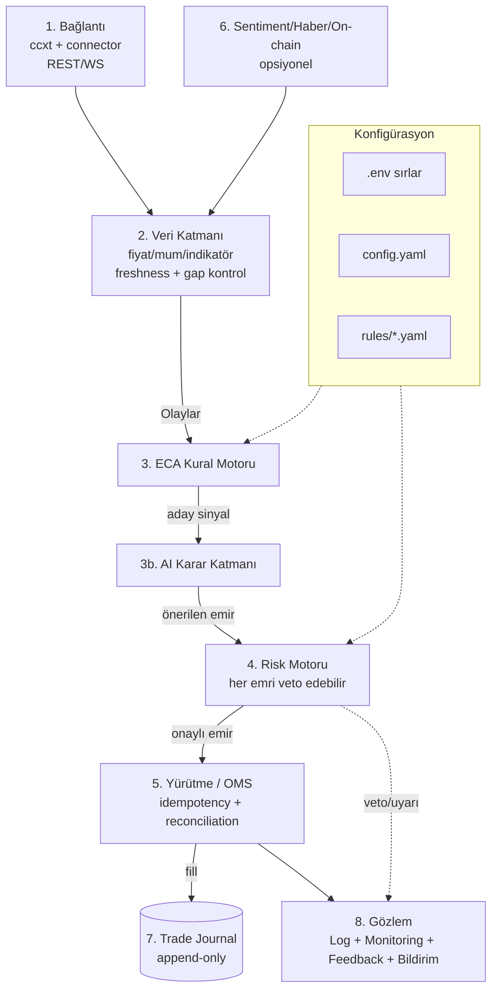

# Katmanlı Mimari & Yürütme Modları

## Genel bakış

Sistem, gevşek bağlı katmanların bir **event bus / message bus** üzerinden haberleştiği, event-driven bir mimaridir. Bu desen açık kaynak framework'lerin (özellikle NautilusTrader) kanonik yaklaşımıdır ve backtest ile canlı çalışmayı tek strateji arayüzü arkasında birleştirir.



## Katmanlar

| # | Katman | Sorumluluk |
|---|--------|------------|
| 1 | **Bağlantı** | Borsa REST/WebSocket. İmzalama, rate-limit muhasebesi, retry/reconciliation, WS yaşam döngüsü. Ürün başına adapter (spot/futures/margin). Bkz. [Binance API](binance-api.md). |
| 2 | **Veri** | Canlı fiyat/mum, indikatör hesabı, order book, funding. **Veri tazelik ve boşluk kontrolü** (bayat veri → `NO_TRADE`). Olay yayımı. |
| 3 | **ECA Kural Motoru** | Olayları dinler, kuralları değerlendirir, **aday sinyal** üretir (boyutlandırmaz). Deterministik. Bkz. [ECA](../eca/anatomi.md). |
| 3b | **AI Karar Katmanı** | Aday sinyali filtreler/veto eder, rejim bilgisi ekler. Yeni sinyal üretmez. Bkz. [AI Katmanı](../eca/ai.md). |
| 4 | **Risk Motoru** | Pozisyon boyutu, SL/TP, max kaldıraç, günlük zarar, drawdown, korelasyon. **Her emri bağımsız veto edebilir.** Bkz. [Risk](../risk/yonetim.md). |
| 5 | **Yürütme / OMS** | Emir gönderimi, emir durum makinesi, idempotency, reconciliation, kısmi doluş takibi. |
| 6 | **Sentiment/Haber/On-chain** | Opsiyonel zenginleştirme. **Tek başına asla emir tetiklemez.** Bkz. [Veri Kaynakları](../veri/kaynaklar.md). |
| 7 | **Trade Journal** | Emir niyeti ↔ borsa sonucu, PnL, neden-sonuç. Append-only denetim günlüğü. |
| 8 | **Gözlem** | Loglama, canlı monitoring, feedback, bildirim. Bkz. [Gözlem](../gozlem/loglama.md). |

### Katmanlı bağımlılık ilkesi
Her modül yalnızca `core` ve zincirde üstündeki modüllere bağımlıdır; event bus asenkron sorumluluk zincirini çözer. Bu, her modülün ayrı ayrı test edilebilmesini sağlar (özellikle risk motoru saf fonksiyon olarak birim testine tabi tutulmalı).

## Kanonik event akışı

```
[Feed Handler] --MarketEvent--> [ECA Engine] --SignalEvent-->
[AI Layer] --(filtered)--> [Risk/Portfolio] --OrderEvent-->
[Execution/OMS] --FillEvent--> [Portfolio + Journal]
```

- **MarketEvent** — tick/bar/indikatör güncellemesi.
- **SignalEvent** — yönsel niyet (long/short/exit). Boyut yok.
- **OrderEvent** — risk motorunun boyutlandırıp onayladığı somut emir.
- **FillEvent** — gerçekleşen doluş; portföy ve journal güncellenir.

## Yürütme modları

Aynı strateji kodu dört modda da çalışır — fark yalnızca `DataFeed` ve `ExecutionHandler` adapter'larındadır (adapter/port deseni).

| Mod | DataFeed | Execution | Amaç |
|-----|----------|-----------|------|
| **backtest** | Tarihsel veri | Simüle fill (komisyon + slippage modeli) | Strateji doğrulama, parametre arama |
| **paper / shadow** | **Canlı WS feed** | Simüle fill (gerçek fiyat, sahte para) | Canlı-benzeri doğrulama, risksiz |
| **semi-auto** | Canlı WS feed | Gerçek borsa **ama insan onayından sonra** (Telegram/GUI) | Kontrollü gerçek para |
| **full-auto** | Canlı WS feed | Gerçek borsa, otomatik | Tam otomatik (deterministik + risk-sınırlı çerçeve içinde) |

!!! note "Shadow mode neden ayrı bir aşama?"
    Shadow mode = **canlı feed + simüle execution**. Strateji gerçek zamanlı çalışır, gerçek emir vermez ama "verseydi ne olurdu"yu kaydeder. Backtest ile canlı arasındaki sapmayı (implementation shortfall: slippage, latency, kısmi doluş) para riski olmadan ölçmenin tek yoludur. Yol haritasında Faz 3.5.

## Deployment (Hetzner)

- Ubuntu VPS üzerinde **Docker + docker-compose**.
- Servisler: bot çekirdeği, FastAPI backend, (opsiyonel) PostgreSQL/TimescaleDB, reverse proxy (Caddy/Nginx + TLS).
- **Otomatik yeniden başlatma** (`restart: unless-stopped`) + healthcheck.
- Kill-switch bot çekirdeğinden **bağımsız** bir süreç/uç olarak erişilebilir olmalı (motor kilitlense bile durdurabilmeli).
- Saat senkronu (NTP) zorunlu — Binance `recvWindow` için. Bkz. [Güvenlik](../guvenlik.md).
